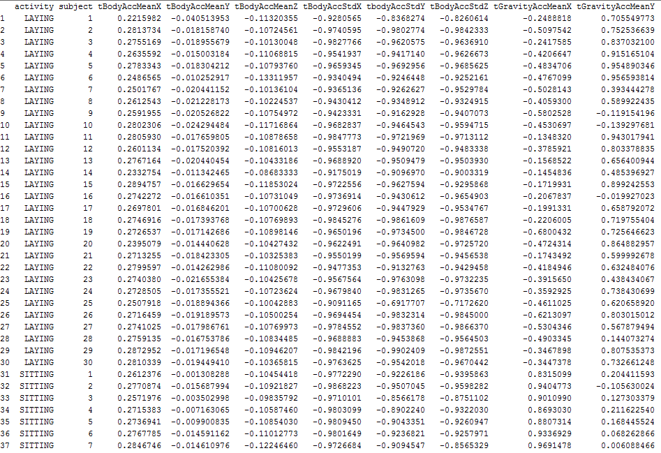

# Introduction

This demonstration using the R programming language produced a tidy data set comprising averages of mean and std deviations columns from the raw data set. The raw data was produced by the *Human Activity Recognition on Smartphones using a Multiclass Hardware-Friendly Support Vector Machine*  experiment carried out by *International Workshop of Ambient Assisted Living (IWAAL 2012).* That project's data and details is located at: [UCI Machine Learning Repository](http://archive.ics.uci.edu/ml/datasets/Human+Activity+Recognition+Using+Smartphones) and the following extract taken from the UCI site page gives a summary overview. 

><i>The experiments have been carried out with a group of 30 volunteers within an age bracket of 19-48 years. Each person performed six activities (WALKING, WALKING_UPSTAIRS, WALKING_DOWNSTAIRS, SITTING, STANDING, LAYING) wearing a smartphone (Samsung Galaxy S II) on the waist. Using its embedded accelerometer and gyroscope, we captured 3-axial linear acceleration and 3-axial angular velocity at a constant rate of 50Hz. The experiments have been video-recorded to label the data manually. The obtained dataset has been randomly partitioned into two sets, where 70% of the volunteers was selected for generating the training data and 30% the test data.</i>

><i>The sensor signals (accelerometer and gyroscope) were pre-processed by applying noise filters and then sampled in fixed-width sliding windows of 2.56 sec and 50% overlap (128 readings/window). The sensor acceleration signal, which has gravitational and body motion components, was separated using a Butterworth low-pass filter into body acceleration and gravity. The gravitational force is assumed to have only low frequency components, therefore a filter with 0.3 Hz cutoff frequency was used. From each window, a vector of features was obtained by calculating variables from the time and frequency domain.</i>

><i> The experiments have been carried out with a group of 30 volunteers within an age bracket of 19-48 years. Each person performed six activities (WALKING, WALKING_UPSTAIRS, WALKING_DOWNSTAIRS, SITTING, STANDING, LAYING) wearing a smartphone (Samsung Galaxy S II) on the waist. Using its embedded accelerometer and gyroscope, we captured 3-axial linear acceleration and 3-axial angular velocity at a constant rate of 50Hz. The experiments have been video-recorded to label the data manually. The obtained dataset has been randomly partitioned into two sets, where 70% of the volunteers was selected for generating the training data and 30% the test data. </i> 

><i>The sensor signals (accelerometer and gyroscope) were pre-processed by applying noise filters and then sampled in fixed-width sliding windows of 2.56 sec and 50% overlap (128 readings/window). The sensor acceleration signal, which has gravitational and body motion components, was separated using a Butterworth low-pass filter into body acceleration and gravity. The gravitational force is assumed to have only low frequency components, therefore a filter with 0.3 Hz cutoff frequency was used. From each window, a vector of features was obtained by calculating variables from the time and frequency domain. See 'features_info.txt' for more details. </i>

# Data Preparation

The following are the instructions that were followed to produce the tidy data set. 

Create one R script called run_analysis.R that does the following:

  1. Merges the training and the test sets to create one data set.
  2. Extracts only the measurements on the mean and standard deviation for each measurement.
  3. Use descriptive activity names to name the activities in the data set
  4. Appropriately label the data set with descriptive variable names.
  5. From the data set in step 4, creates a second, independent tidy data set with the average of each variable for each activity and each subject.
  
For details of the R implementation see the [README.md](README.md) and the script at: [run_analysis.R](run_analysis.R)

# Code Book

The Raw data file comprised 561 numeric variables capturing the sensor data where this was filtered down, by this project, to 86 variables capturing mean and standard deviation measures. Also, each measure row includes a subject id and an activity. The list below describes each of the variable presented in the resulting tidy data set.

* __activity__ - describes the activity and can be one of: WALKING, WALKING\_UPSTAIRS, WALKING\_DOWNSTAIRS, 
SITTING, STANDING, or LAYING
* __subject__ - an integer between 1 and 30 identifying the volunteer in the experiment. 
* __tbodyAccMeanX__ - Average of all time domain body acceleration signal mean for X.
* __tbodyAccMeanY__ - Average of all time domain body acceleration signal mean for Y.
* __tbodyAccMeanZ__ - Average of all time domain body acceleration signal mean for Z.
* __tbodyAccStdX__ - Average of all time domain body acceleration signal standard deviation for X.
* __tbodyAccStdY__ - Average of all time domain body acceleration signal standard deviation for Y.
* __tbodyAccStdZ__ - Average of all time domain body acceleration signal standard deviation for Z.
* __tGravityAccMeanX__ - Average of all time domain gravity acceleration signal mean for X.
* __tGravityAccMeanY__ - Average of all time domain gravity acceleration signal mean for Y.
* __tGravityAccMeanZ__ - Average of all time domain gravity acceleration signal mean for Z.
* __tGravityAccStdX__ - Average of all time domain gravity acceleration signal standard deviation for X.
* __tGravityAccStdY__ - Average of all time domain gravity acceleration signal standard deviation for Y.
* __tGravityAccStdZ__- Average of all time domain gravity acceleration signal standard deviation for Z.
* __tbodyAccJerkMeanX__ - Average of all time domain body acceleration jerk signal mean for X.
* __tbodyAccJerkMeanY__ - Average of all time domain body acceleration jerk signal mean for Y.
* __tbodyAccJerkMeanZ__ - Average of all time domain body acceleration jerk signal mean for Z.
* __tbodyAccJerkStdX__ - Average of all time domain body acceleration jerk signal standard deviation for X.
* __tbodyAccJerkStdY__ - Average of all time domain body acceleration jerk signal standard deviation for X.
* __tbodyAccJerkStdZ__ - Average of all time domain body acceleration jerk signal standard deviation for X.
* __tbodyGyroMeanX__ - Average of all time domain body gyro signal mean for X.
* __tbodyGyroMeanY__ - Average of all time domain body gyro signal mean for Y.
* __tbodyGyroMeanZ__ - Average of all time domain body gyro signal mean for Z.
* __tbodyGyroStdX__ - Average of all time domain body gyro signal standard deviation for X.
* __tbodyGyroStdY__ - Average of all time domain body gyro signal standard deviation for Y.
* __tbodyGyroStdZ__ - Average of all time domain body gyro signal standard deviation for Z.
* __tbodyGyroJerkMeanX__ - Average of all time domain body gyro jerk signal mean for X.
* __tbodyGyroJerkMeanY__ - Average of all time domain body gyro jerk signal mean for Y.
* __tbodyGyroJerkMeanZ__ - Average of all time domain body gyro jerk signal mean for Z.
* __tbodyGyroJerkStdX__ - Average of all time domain body gyro jerk signal standard deviation for X.
* __tbodyGyroJerkStdY__ - Average of all time domain body gyro signal jerk standard deviation for Y.
* __tbodyGyroJerkStdZ__ - Average of all time domain body gyro signal jerk standard deviation for Z.
* __tbodyAccMagMean__ - Average of all time domain body acceleration magnitude signal mean.
* __tbodyAccMagStd__ - Average of all time domain body acceleration magnitude signal standard deviation.
* __tGravityAccMagMean__ - Average of all time domain gravity acceleration magnitude signal mean.
* __tGravityAccMagStd__ - Average of all time domain gravity acceleration magnitude standard deviation.
* __tbodyAccJerkMagMean__ - Average of all time domain body acceleration jerk magnitude mean.
* __tbodyAccJerkMagStd__ - Average of all time domain body acceleration jerk magnitude standard deviation.
* __tbodyGyroMagMean__ - Average of all time domain body gyro magnitude mean.
* __tbodyGyroMagStd__ - Average of all time domain body gyro magnitude standard deviation.
* __tbodyGyroJerkMagMean__ - Average of all time domain body gyro jerk magnitude mean.
* __tbodyGyroJerkMagStd__ - Average of all time domain body gyro jerk magnitude standard deviation.
* __fbodyAccMeanX__ - Average of all frequency domain body acceleration signal mean for X.
* __fbodyAccMeanY__ - Average of all frequency domain body acceleration signal mean for Y.  
* __fbodyAccMeanZ__ - Average of all frequency domain body acceleration signal mean for Z.	
* __fbodyAccStdX__ - Average of all frequency domain body acceleration signal standard deviation for X.
* __fbodyAccStdY__ - Average of all frequency domain body acceleration signal standard deviation for Y.	
* __fbodyAccStdZ__ - Average of all frequency domain body acceleration signal standard deviation for Z.	
* __fbodyAccMeanFreqX__ - Average of all frequency domain body acceleration mean frequency for X.
* __fbodyAccMeanFreqY__ - Average of all frequency domain body acceleration mean frequency for Y.
* __fbodyAccMeanFreqZ__ - Average of all frequency domain body acceleration mean frequency for Z.
* __fbodyAccJerkMeanX__ - Average of all frequency domain body acceleration jerk mean for X.
* __fbodyAccJerkMeanY__ - Average of all frequency domain body acceleration jerk mean for Y.
* __fbodyAccJerkMeanZ__ - Average of all frequency domain body acceleration jerk mean for Z.
* __fbodyAccJerkStdX__ - Average of all frequency domain body acceleration jerk standard deviation for X.
* __fbodyAccJerkStdY__ - Average of all frequency domain body acceleration jerk standard deviation for Y.
* __fbodyAccJerkStdZ__ - Average of all frequency domain body acceleration jerk standard deviation for Z.
* __fbodyAccJerkMeanFreqX__ - Average of all frequency domain body acceleration mean frequency for X.
* __fbodyAccJerkMeanFreqY__ - Average of all frequency domain body acceleration mean frequency for Y.	
* __fbodyAccJerkMeanFreqZ__ - Average of all frequency domain body acceleration mean frequency for Z.	
* __fbodyGyroMeanX__ - Average of all frequency domain body gyro mean for X.
* __fbodyGyroMeanY__ - Average of all frequency domain body gyro mean for Y.
* __fbodyGyroMeanZ__ - Average of all frequency domain body gyro mean for Z.
* __fbodyGyroStdX__ - Average of all frequency domain body gyro standard deviation for X.
* __fbodyGyroStdY__ - Average of all frequency domain body gyro standard deviation for Y.
* __fbodyGyroStdZ__ - Average of all frequency domain body gyro standard deviation for Z.
* __fbodyGyroMeanFreqX__ - Average of all frequency domain body gyro mean frequency for X.	
* __fbodyGyroMeanFreqY__ - Average of all frequency domain body gyro mean frequency for Y.	
* __fbodyGyroMeanFreqZ__ - Average of all frequency domain body gyro mean frequency for Z.	
* __fbodyAccMagMean__ - Average of all frequency domain body acceleration magnitude mean.
* __fbodyAccMagStd__ - Average of all frequency domain body acceleration magnitude standard deviation.
* __fbodyAccMagMeanFreq__ - Average of all frequency domain body acceleration magnitude mean frequency.
* __fbodybodyAccJerkMagMean__ - Average of all frequency domain body acceleration jerk magnitude mean.
* __fbodybodyAccJerkMagStd__ - Average of all frequency domain body acceleration jerk magnitude standard deviation.
* __fbodybodyAccJerkMagMeanFreq__ - Average of all frequency domain body acceleration jerk magnitude mean frequency.
* __fbodybodyGyroMagMean__ - Average of all frequency domain body gyro magnitude mean.
* __fbodybodyGyroMagStd__ - Average of all frequency domain body gyro magnitude standard deviation.
* __fbodybodyGyroMagMeanFreq__ - Average of all frequency domain body gyro magnitude mean frequency.
* __fbodybodyGyroJerkMagMean__ - Average of all frequency domain body gyro jerk magnitude mean.
* __fbodybodyGyroJerkMagStd__ - Average of all frequency domain body gyro jerk magnitude standard deviation.
* __fbodybodyGyroJerkMagMeanFreq__ - Average of all frequency domain gyro jerk magnitude mean frequency.
* __angletbodyAccMeanGravity__ - Average of all time domain angle body acceleration mean grativy mean.
* __angletbodyAccJerkMeanGravityMean__ - Average of all time domain angle body acceleration jerk mean gravity mean.
* __angletbodyGyroMeanGravityMean__ - Average of all time domain angle body gyro mean gravity mean.
* __angletbodyGyroJerkMeanGravityMean__ - Average of all time domain angle gyro jerk mean gravity mean.
* __angleXgravityMean__ - Average of all angle gravity mean for X.
* __angleYgravityMean__ - Average of all angle gravity mean for Y.	
* __angleZgravityMean__ - Average of all angle gravity mean for Z.

#Data Illustration

The figure below illustrates the tidy data set produced by this initiative by showing the first 37 rows for data columns: activity, subject and the first 8 numerical columns. 

The full file generated by this initiative can be found here: [summary.txt](summary.txt) 

#References

[1] Davide Anguita, Alessandro Ghio, Luca Oneto, Xavier Parra and Jorge L. Reyes-Ortiz. Human Activity Recognition on Smartphones using a Multiclass Hardware-Friendly Support Vector Machine. International Workshop of Ambient Assisted Living (IWAAL 2012). Vitoria-Gasteiz, Spain. Dec 2012 
http://archive.ics.uci.edu/ml/datasets/Human+Activity+Recognition+Using+Smartphones

